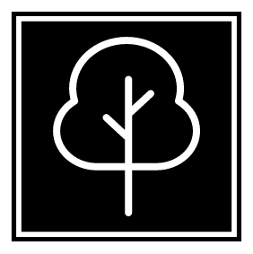

# D-Tree



We provide a one stop portfolio page just by connecting your wallet address. After connecting wallet, profile page will be displayed and the first part contains the Social Handles of the address owner. The next section contains the link to the block explorer of the address. In addition, we have added few portfolio analyzers such as portfolio.nansen, debank.com and zapper.fi. We have also added a search option to check others portfolios using their wallet address or ENS username. We can also send a raw transaction in thier portfolio page with a message and also send crypto.

We have used ENS API so that we could enable portfolio search with thier ENS username.\
For storing data in decentralized manner we have used IPFS for data storage.\
We use push protocol in our DApp to Send and Get notifications.\
We used polygon matic network to run our Dapp.\
We used lens protocol to get users data.

## Links
### [Live app](https://dtree.on.fleek.co/)

### [Demo Video](https://youtu.be/yPBs6JbWo3g)


## To run this Project

Clone this repo with github CLI:
```shell
gh repo clone nuthan2x/De-linktree
```
Install the dependencies:
```shell
npm install
```
Run the app in your localhost:
```shell
npm start
```
